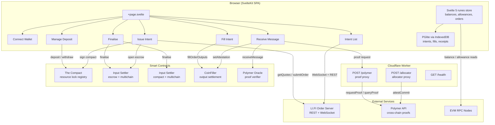

# Lintent

Lintent is LI.FI's interactive demo for the [Open Intents Framework (OIF)](https://openintents.xyz). It walks through the full cross-chain intent lifecycle, from resource lock management and intent issuance to solving, proof submission, and finalisation. The live app is hosted at [lintent.org](https://lintent.org).

The app handles both sides of an intent: the user (intent issuer) and the solver. Each step maps to a dedicated screen so you can follow the entire flow in sequence.

## Architecture



## Intent Lifecycle

The app exposes six sequential screens, each representing one step in the OIF flow.

- **Connect Wallet** connects via Web3-Onboard (injected wallets, Coinbase, WalletConnect, Zeal)
- **Manage Deposit** lets you choose between escrow and compact locking, then deposit or withdraw tokens from The Compact
- **Issue Intent** configures the intent (input/output tokens, chains, amounts, verifier), fetches a quote from the LI.FI order server, and submits the order on-chain (escrow) or via EIP-712 signature (compact)
- **Intent List** shows open intents from the order server WebSocket and local DB, with the option to import by on-chain order ID
- **Fill Intent** is the solver side, where output tokens are delivered to recipients via the CoinFiller contract on each output chain
- **Receive Message** fetches a cross-chain proof from Polymer and submits it to the Polymer Oracle on the source chain (or calls `setAttestation` for same-chain fills)
- **Finalise** calls `finalise()` on the appropriate input settler, releasing the locked input tokens to the solver

## Tech Stack

- **Framework** SvelteKit 2 with Svelte 5 runes
- **Language** TypeScript
- **Styling** Tailwind CSS v4
- **EVM** viem ~2.45
- **Wallet** Web3-Onboard
- **Local DB** PGlite (WASM Postgres) + Drizzle ORM, persisted to IndexedDB
- **Deployment** Cloudflare Workers via `@sveltejs/adapter-cloudflare`
- **Runtime** Bun
- **Testing** Bun test (unit/integration) and Playwright (E2E)

## Supported Chains

**Mainnet** Ethereum, Base, Arbitrum, Polygon, BSC, MegaETH, Katana

**Testnet** Sepolia, Base Sepolia, Arbitrum Sepolia, Optimism Sepolia

## Smart Contracts

The app interacts with the following deployed contracts (ABIs are inlined in `src/lib/abi/`).

| Contract                | Purpose                                                                              |
| ----------------------- | ------------------------------------------------------------------------------------ |
| The Compact             | ERC-6909 resource lock registry for compact-based intents                            |
| Input Settler (Escrow)  | Opens and finalises escrow-based intents (single-chain and multichain variants)      |
| Input Settler (Compact) | Finalises compact-based intents using combined sponsor and allocator signatures      |
| CoinFiller              | Output settlement where solvers deliver tokens, also handles same-chain attestations |
| Polymer Oracle          | Verifies cross-chain fill proofs submitted via Polymer                               |

## Project Structure

```
src/
  lib/
    abi/              # contract ABIs (Compact, Escrow, CoinFiller, Polymer Oracle, etc.)
    libraries/        # core logic (Intent, IntentFactory, OrderServer, Solver, CompactLib)
    screens/          # SvelteKit components for each step in the flow
    utils/            # helpers (EIP-712 typed data, order validation, address encoding)
    config.ts         # contract addresses, chain config, token lists, RPC clients
    state.svelte.ts   # global reactive store (Svelte 5 runes)
    db.ts             # PGlite + Drizzle init with IndexedDB persistence
    schema.ts         # Drizzle table definitions
  routes/
    +page.svelte      # single-page entry point (renders all six screens)
    polymer/          # server route proxying to Polymer API
    allocator/        # server route proxying to Polymer Allocator
    health/           # liveness check
tests/
  unit/               # order validation, intent list, order server parsing, asset selection
  e2e/                # Playwright browser tests for issuance flow
  db.test.ts          # PGlite integration test
```

## Getting Started

1. Copy `.env.example` to `.env`
2. Create a [WalletConnect](https://walletconnect.com) project and add the project ID
3. Create an account with [Polymer](https://accounts.polymerlabs.org/) and generate API keys for mainnet and testnet
4. Install dependencies with `bun install`
5. Start the dev server with `bun run dev`

## Testing

- `bun run test:unit` runs library and unit tests with coverage
- `bun run test:e2e` runs Playwright browser tests (requires `bunx playwright install chromium`)
- `bun run test:all` runs both suites

## Deployment

Production deploys happen on push to `main` via GitHub Actions. The workflow builds with Bun and deploys to the `lintent-worker` Cloudflare Worker. PR preview environments are created and cleaned up automatically.

Required secrets for CI: `CLOUDFLARE_API_TOKEN`, `CLOUDFLARE_ACCOUNT_ID`, `PRIVATE_POLYMER_MAINNET_ZONE_API_KEY`, `PRIVATE_POLYMER_TESTNET_ZONE_API_KEY`, `PUBLIC_WALLET_CONNECT_PROJECT_ID`.

## License

This project is licensed under the [MIT License](/LICENSE).
